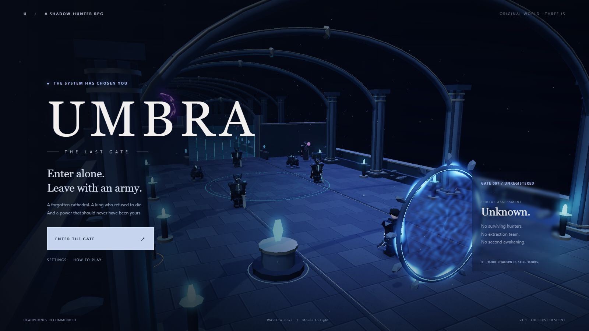

# UMBRA — THE LAST GATE

**Enter alone. Leave with an army.**

[**Play in your browser**](https://samg-coder.github.io/Umbra-The-Last-Gate/)

**One shot in the browser using 6 Pro.**



An original, single-player Three.js action-RPG prototype inspired by the shadow-hunter fantasy of **Solo Levelling**. You enter a ruined cathedral as an unranked hunter, extract defeated enemies into your shadow roster, and challenge **Vael, the Hollow King**.

This is a complete, small **single-dungeon gameplay loop**, not a commercial-scale RPG. It has original procedural 3D artwork, animated characters, combat, three connected halls, progression, a boss, death/retry, saved hunters, and a repeatable Ascension mode. It is not an official Solo Levelling game and contains no ripped franchise assets.

## Start playing

### Windows

1. Extract the entire ZIP into a normal folder.
2. Double-click **`START-WINDOWS.bat`**.
3. The launcher opens the game at **http://127.0.0.1:8000**. Keep its terminal open while playing.

You need **Node.js 18+** or **Python 3.8+** installed. The launcher tries Node first and then Python. No npm package installation is needed.

The pinned Three.js 0.180.0 engine is included in `vendor/`. If those files are missing, the launcher downloads them on first launch; that repair requires internet access. With both engine files present, the project has no runtime dependency on a CDN. All game art, textures, music and sound effects are produced locally. The browser also has a CDN fallback when the local engine is missing.

### Node, any platform

```sh
npm start
```

Open **http://127.0.0.1:8000**. To open it automatically:

```sh
node tools/serve.mjs --open
```

### Python, any platform

```sh
python tools/serve.py --open
# On macOS/Linux, use python3 if necessary.
```

### macOS / Linux launcher

```sh
chmod +x start.sh
./start.sh
```

**Do not double-click `index.html`.** Browsers restrict native JavaScript modules on `file://` URLs. The included local server is required. There is no account, backend database, or external game service.

## Controls

| Input | Action |
| --- | --- |
| WASD / arrow keys | Camera-relative movement |
| Hold left mouse / J | Three-strike twin-blade combo |
| Space | Shadow Step: dodge with brief invulnerability |
| Q | Rift Cleave: wide, piercing shadow projectile |
| E | Extract a nearby fallen enemy into your roster |
| R | Arise: summon your collected shadows for 24 seconds |
| 1 | Drink a recovery potion |
| F | Open coffers, read memories, use the shrine |
| Right mouse + drag | Orbit camera |
| Mouse wheel | Change camera distance |
| Tab / I | Hunter record, attributes, equipment, shadow roster |
| Esc | Pause, or close a dismissible menu |
| H | Controls and combat guide |

Touch controls include a movement stick, swipe-to-orbit camera, held attack button and skill buttons. Use landscape orientation. Touch-device performance and real-device input have **not** been verified.

## The hunt

**The Forsaken Nave.** Learn to read the sentinels’ wind-ups. Claim equipment from the side coffers. The blue shrine near the entrance can temper your equipped weapon and restore your supplies.

**The Sunken Choir.** More aggressive enemies, ranged spellcasters and an executioner demand better positioning. Your shadows can draw enemies away while your piercing attacks hit groups.

**Throne of the Hollow King.** Vael changes his attacks as his health falls. His three phases use cleaves, a large ground nova, projectile rings and delayed ground sigils. A defeated monarch unlocks Ascension.

A cleared first or second hall offers a choice of three blessings drawn from seven. Choose damage, sustain, mobility, survival, essence or shadow power. The seal opens after choosing. New checkpoints restore health, essence, stamina and recovery potions.

Enemy types are hollow sentinels, grave stalkers, ash spellcasters, an executioner and the monarch. The initial layout contains **17 enemies, five coffers, three memories and one shrine**. It is a compact dungeon, not an open world or a procedural campaign.

## Progression and saves

Levels grant two attribute points. Strength improves your weapons; vitality improves health and armour; agility improves critical chance and cooldowns; spirit improves essence and your shadow army. Open the hunter record to spend points.

Loot is not auto-equipped. Compare its power in the inventory, equip upgrades and salvage spare items. The shrine permanently adds power to the currently equipped weapon, not every weapon you own. Your stored roster and active legion are separate: extraction stores a shadow; Arise deploys it.

The hunter record saves in your browser’s local storage at the current server address. It preserves levels, attributes, equipment, inventory, crystals, roster, claimed coffers, cleared halls, blessings and the latest checkpoint. **An unfinished hall restarts on reload or retry**; individual enemy health, current health and active cooldowns are not checkpointed. Death costs 10% of your crystals, not your equipment or levels.

Use **Export Save** in the hunter record to keep a backup or transfer browsers. Importing explicitly replaces the local hunter after confirmation. A new hunt also asks before replacing an existing save. Changing the server port, browser profile or hostname uses a different browser storage origin.

Ascension retains your hunter and equipment, increases enemy strength, resets the dungeon and its coffers, and replaces the previous descent’s blessings.

## Presentation

The visual style is stylised dark fantasy, not photorealism. The cathedral has gothic ribs, fluted pillars, stone textures, metal inlay, crystal braziers, reflective material strips, portals, environmental dust and a giant throne effigy. Jointed hunters and enemies have procedural idle, locomotion, strike, casting and death poses. There are blade arcs, hit sparks, expanding spells, attack warnings and rising shadow remnants.

Rendering uses **Three.js WebGLRenderer / WebGL2**, a generated reflection environment, a directional shadow map and a six-light pool. High settings add a custom HDR bloom, tone mapping and vignette pass. This is **not WebGPU, ray tracing, DLSS or ThreeRuntime integration**. Repeated static geometry is merged by material and particles use instancing.

All music and effects are generated by Web Audio after user interaction. The score uses a restrained minor-key pulse. There are no external audio files or font downloads.

## Graphics and accessibility

Choose Low, Medium, High or Ultra in Settings. Low disables post-processing and real-time shadows. Medium reduces resolution and shadow-map cost. High is the default; Ultra increases resolution and shadow detail. These are configuration presets, **not measured device performance promises**.

Settings include Story, Hunter and Nightmare incoming-damage difficulty, master volume, music, camera shake, damage numbers and an FPS display. Menus pause gameplay. Losing window focus also pauses an active hunt. Keyboard attack is supported in addition to mouse and touch. Full screen-reader gameplay, remappable controls and controller support are not implemented.

## Validation — read this before treating the build as finished

See **`TEST-REPORT.md`** and the `tests/` folder.

- 44 automated rules and gameplay tests pass.
- A deterministic headless hunter completed the full three-hall campaign and victory transition using the actual game-state logic.
- Twelve actual UI/input smoke checks pass in Chromium with a stubbed game interface. Desktop and landscape-phone HUD layouts were inspected without the 3D scene.
- JavaScript syntax, local import paths and HTML asset paths pass checks.
- The Node server returned the expected assets/MIME types, rejected a traversal request and returned 404 for a missing file.
- **Full Three.js rendering and real gameplay feel could not be tested in this environment.** Its Chromium instance did not expose WebGL2, and engine download access was unavailable. The gameplay tests deliberately replace rendering/audio/UI with test doubles; they do not prove graphical correctness or performance.
- Windows launching, real mobile touch, driver compatibility, sound balance and longer play sessions still need real-device validation.

The source is provided so the build can be run, inspected and developed further. Do not mistake automated state tests for a human play-test or production certification.

### Run the included checks

```sh
npm run check
npm test
node --experimental-loader ./tests/loader.mjs tests/campaign.mjs
```

Node 18+ supports the test commands. The experimental-loader command may print a Node deprecation warning; that is not a game error. The loader exists only for rendering-independent tests and is never used by the game.

To exercise the actual GPU shader checker on your machine, start the server and open **http://127.0.0.1:8000/tests/shader-check.html**. It checks the custom shader programs, not the full game.

For development-only inspection, append **`?dev=1`** to the game address. This exposes the current instance as `window.umbra`. Ordinary play does not expose this hook.

## Project structure

```text
index.html, style.css       Menu, HUD, responsive controls and record screens
src/bootstrap.js           Local-first engine loading and useful failure messages
src/main.js                Initialisation and guarded frame loop
src/game.js                Player, enemies, abilities, progression and encounters
src/rules.js               Deterministic combat/progression/collision/save rules
src/data.js                Dungeon layout, enemy statistics, loot and skill text
src/models.js              Original jointed models and procedural textures
src/world.js               Cathedral, gates, coffers, shrine, portals and lighting
src/render.js              Three.js renderer and custom post-processing
src/effects.js             Pooled particles, blade arcs and attack telegraphs
src/audio.js               Synthesised soundtrack and sound effects
src/input.js, src/ui.js     Keyboard/mouse/touch and menus
src/save.js                Validated local saves and JSON import/export
vendor/                    Downloaded Three.js engine and its MIT licence
assets/                    Original SVG emblem
tools/                     Node/Python launchers and source checks
tests/                     Automated checks and recorded results
.github/workflows/         Optional static GitHub Pages deployment
```

## Troubleshooting

**“Three.js is not installed locally.”** Connect to the internet and run `npm run vendor`, or restart a launcher. This build pins `three.module.js` and `three.core.js` from Three.js 0.180.0. A network filter can block the CDN; the launcher also attempts the official Three.js repository. Do not substitute files from different releases.

**Black screen, a graphics error, or a lost graphics context.** Use a browser with WebGL2 and hardware acceleration enabled. Try a lower quality setting. This build has not been verified against your GPU/driver. A visible error panel reports initialisation and frame errors rather than silently hiding them.

**Port 8000 is already in use.** Close the previous server or run `node tools/serve.mjs --port 8001 --open`. A different port has a separate local save; export first where possible.

**No sound.** Start a hunt with a click/tap and check browser audio permissions and Settings. Web Audio will not intentionally autoplay before interaction.

**Phone testing.** On a trusted local network, start `node tools/serve.mjs --host 0.0.0.0`. Open the computer’s LAN address and port 8000 on the phone. Only use this on a trusted network; the default is loopback-only. The game does not require pointer lock or a secure-context-only renderer.

## Static hosting

The game can be hosted as static files. Download the engine with `npm run vendor`, then publish `index.html`, `style.css`, `src/`, `assets/` and `vendor/` preserving their paths. No bundler is required.

An optional `.github/workflows/pages.yml` is included. It downloads the engine, runs source/rules checks, packages the static site and deploys GitHub Pages when the repository’s Pages source is configured to **GitHub Actions**. The public repository is [SamG-Coder/Umbra-The-Last-Gate](https://github.com/SamG-Coder/Umbra-The-Last-Gate). The workflow uses source checks and fast unit/game tests; it does not install a browser or run browser tests.

## Credits and licensing

Original game code and generated art/audio definitions: MIT; see `LICENSE`.

Three.js: MIT; see `vendor/THREE-LICENSE.txt`. The library is fetched from the upstream pinned release and remains separately copyrighted.

Technical references: https://threejs.org/docs/pages/WebGLRenderer.html and https://github.com/mrdoob/three.js/tree/r180 . The custom effects here are original implementation code, not copied commercial game assets.
